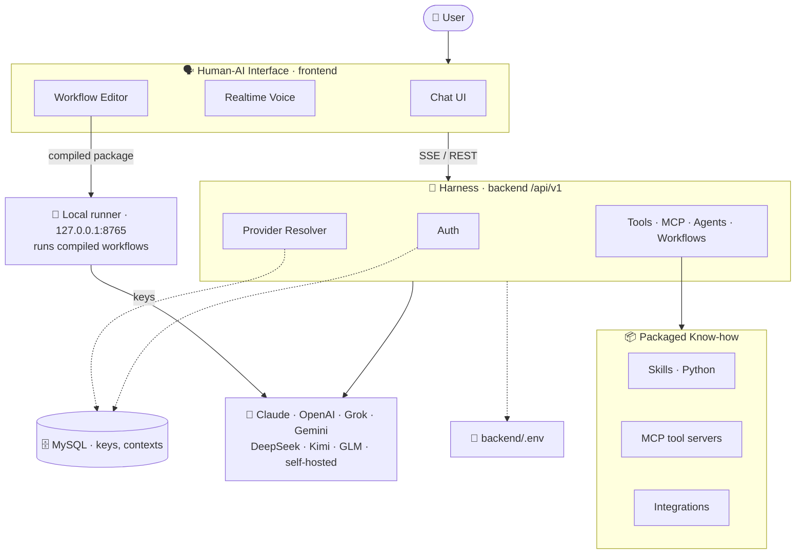

# gpt — Multi‑Provider AI Framework

A self‑hostable **framework for building with many LLM providers**. It brings together three things:

- 🧩 **A harness** — a backend runtime that brokers **Claude, OpenAI, Grok, Gemini, DeepSeek, Kimi,
  GLM and self-hosted (vLLM) models** behind one API, with streaming, function/tool calling, MCP,
  agent teams and workflows. It handles provider resolution, auth, tool execution and orchestration
  so you don't have to. The same runtime comes in three interchangeable implementations — PHP
  (reference), TypeScript and Python.
- 🗣️ **A human‑AI interface** — a frontend for *directing* and *conversing with* the AI: a chat UI,
  realtime voice, and a visual workflow editor.
- 📦 **Packaged know‑how** — reusable capability built in: browser‑side **Skills** (Python), MCP tool
  servers, agent‑team designs, workflow templates, and service integrations (search, financial,
  PubMed, Google Drive).

Chat is just one surface onto a general multi‑provider AI orchestration layer.

> **Status:** standalone, self‑hostable. Secrets live outside the repo — see [Configuration](#configuration--secrets).

---

## What it does

- **One chat API, many providers.** Talk to **Claude, OpenAI, Grok, Gemini, DeepSeek, Kimi, GLM**
  and any OpenAI-compatible endpoint you host yourself, through a single endpoint. Provider keys are
  managed in the database (global + per‑user), not in code.
- **Streaming.** Responses stream over **Server‑Sent Events (SSE)**, with progress, verifier, and
  compare events.
- **Tools & MCP.** Function‑calling with a server‑side tool registry and **MCP** (Model Context
  Protocol) servers, plus **client‑side "Skills"** that run **Python in the browser** (Pyodide/WASM)
  against the user's local folder via the File System Access API.
- **Realtime voice.** A voice prompt‑builder backed by **Hume EVI**, **Grok realtime**, and
  **Gemini native audio**.
- **Agents & workflows.** Agent teams and a **visual workflow editor** that compiles one canvas to
  **four runtimes** — LangGraph, **Google ADK**, **Microsoft Agent Framework** and **NVIDIA NOOA** —
  as self-contained Python you can read, keep and run without this app. Dispatcher nodes route to one
  branch instead of fanning out, and playbook nodes run an interpreter loop with human gates (forms,
  approvals, hand-offs) that surface in the conversation. Compiled workflows run on **your machine**
  through a small local runner, not on the web server.
- **Auth & accounts.** Firebase (Google/Facebook OAuth), app keys, per‑user API keys, plans/subscriptions.
- **Integrations.** Web/search (SerpAPI, Brave, ScrapingDog), financial data (FMP), PubMed, Google Drive.

---

## Architecture



The harness has three interchangeable implementations behind the same `/api/v1` contract: **PHP**
(the reference), **TypeScript** and **Python**. Compiled workflows do not run in any of them — the
editor writes a self-contained Python package into your local folder and a **local runner** executes
it as your user, which is what lets a workflow read your files and ask you questions mid-run.

Repository layout:

```
gpt/
├── backend/            PHP 8.1+ API (front controller at /api/v1) — the reference implementation
│   ├── src/                controllers, services (LLMProviderResolver, …), AgentTeam, middleware
│   │   └── AgentTeam/      workflow compilers: LangGraph, ADK, MAF, NOOA + the shared
│   │                       PlaybookEmit interpreter and RunServerEmitter
│   ├── config/             ai_config.php (reads backend/.env), load_env.php
│   ├── schema/             chatbot.sql, migrations, run-protocol-v1.json (event contract)
│   └── .env                secrets (gitignored; copy from .env.example)
├── backend_typescript/ Node/TypeScript port of the same API (port 3001)
├── backend_python/     FastAPI port of the same API (port 3002)
├── langchain_runner/   source of the local Python runner; installed into your chosen
│                       folder by the setup wizard, or by `python3 setup.py`
└── frontend/           static HTML/CSS/JS (no build step), served by any web server
    ├── assets/js/          config.js (gitignored), chat, voice, workflow editor
    └── voice/              voice PWA + config.json (gitignored)
```

- **LLM provider keys live only in the database** (`system_llm_settings` global, `user_api_keys`
  per‑user), resolved by `LLMProviderResolver` — never in committed files.
- The backend uses **two MySQL connections**: a primary `chatbot` DB (auth, contexts,
  provider settings) and a residual `portfolio_manager` connection inherited from the app this was
  derived from (documented in `docs/HARDENING.md`, which is not published — see *Documentation* below).

---

## Installation

**Prerequisites**

| | Needed for | Notes |
|---|---|---|
| PHP 8.1+ · Composer · MySQL | the backend | any of the three backends needs MySQL |
| A web server | serving `frontend/` and the PHP backend | see *No Apache?* below |
| Python 3.10+ | compiled workflows (LangGraph / ADK / MAF / NOOA) | optional, installed from the app |
| Node.js 18+ | only for the TypeScript backend | optional |

### No Apache? Install XAMPP

XAMPP bundles Apache, MySQL (MariaDB) and PHP in one installer — the shortest path if you have none of them.

1. Download it from [apachefriends.org](https://www.apachefriends.org/) and install.
2. Start **Apache** and **MySQL** from the XAMPP control panel.
3. Clone this repo into XAMPP's web root so it is served at `/gpt`:

```bash
# macOS
cd /Applications/XAMPP/xamppfiles/htdocs && git clone https://github.com/didierphmartin/gpt.git
# Windows:  C:\xampp\htdocs      Linux:  /opt/lampp/htdocs
```

4. The app is then at `http://localhost/gpt/frontend/index.html`.

Already have Apache/nginx? Serve the repo so the frontend reaches the backend at `/gpt/backend` (that
default lives in `frontend/assets/js/api-config.js`), or point the app at a Node/Python backend instead — see
*Other backends* below.

### 1. Backend dependencies

```bash
cd backend && composer install
```

### 2. Databases

gpt uses **two** MySQL connections. The schema dump creates the first:

```bash
mysql -u <user> -p < backend/schema/chatbot.sql     # creates netfo587_chatbot (41 tables)
```

- **Contexts DB** (`netfo587_chatbot`) — everything gpt owns: users, agents, workflows, playbooks,
  app keys, `system_llm_settings`.
- **Main DB** — gpt was derived from another product and still reads a few of its tables. That schema
  is not included. Point `DB_*` at that database if you have it; otherwise point it at the contexts DB
  so the app boots, and expect the handful of features reading those tables to be inert.
  See [`backend/schema/README.md`](backend/schema/README.md).

### 3. Backend secrets

```bash
cp backend/.env.example backend/.env
```

`backend/config/load_env.php` **refuses to boot** until these ten are filled in:

```
DB_HOST  DB_NAME  DB_USER  DB_PASS
CTX_DB_HOST  CTX_DB_NAME  CTX_DB_USER  CTX_DB_PASS
JWT_SECRET  APP_KEY_SECRET          # openssl rand -hex 32
```

Everything else in that file is optional and documented inline — blank simply leaves the feature off.

**LLM provider keys do not go here.** They are rows in `system_llm_settings` in the contexts DB, edited
in the app under *Admin → LLM settings*.

### 4. Frontend config

```bash
cp frontend/assets/js/config.example.js frontend/assets/js/config.js
cp frontend/voice/config.example.json   frontend/voice/config.json
```

Fill in the Firebase web config (needed only for social login). Both files are gitignored. Note that
anything placed here is **served to the browser** — it is not a secret store.

### 5. First run

Open `http://localhost/gpt/frontend/index.html` and sign in. A setup wizard asks for a **local folder**;
everything the app reads or writes lives there (`skills/`, `outputs/`, `python/`).

The wizard also installs the Python runner into `<your folder>/python/`. To finish it — a browser cannot
create a virtual environment — run once, in that folder:

```bash
cd <your folder>/python
python3 -m venv .venv && ./.venv/bin/pip install -r requirements.txt
```

Then start the runner from the same folder, and leave it running:

```bash
./.venv/bin/python main.py          # NOT bare python3 — the venv holds the frameworks
```

To have it start at login instead (macOS): `python3 setup.py --launchagent` from `langchain_runner/`.

Compiled workflows need that runner: your machine executes them, not the web server. Browser-only
storage (OPFS) therefore cannot host them — chat and browser-side Python skills still work.

### Other backends (optional)

The PHP backend is the reference implementation. Two ports exist and speak the same API; pick one in
*Settings → Account*, which sets the base URL from `frontend/assets/js/api-config.js`.

```bash
# Node.js — http://localhost:3001
cd backend_typescript && npm install && cp .env.example .env && npm run dev

# Python — http://localhost:3002
cd backend_python && python3 -m venv .venv && ./.venv/bin/pip install -r requirements.txt
cp .env.example .env && ./run.sh
```

Both read the same two databases and must share `JWT_SECRET` and `APP_KEY_SECRET` with the PHP backend,
or a session issued by one is rejected by the other.

---

## Configuration & secrets

All secrets are kept **out of the repository** and gitignored; committed `*.example` templates
document every key:

| Real file (gitignored) | Template (committed) | Holds |
|---|---|---|
| `backend/.env` | `backend/.env.example` | DB connectors, `jwt_secret`, `app_key_secret`, voice/search/financial keys |
| `frontend/assets/js/config.js` | `config.example.js` | Firebase web config + voice provider keys |
| `frontend/voice/config.json` | `voice/config.example.json` | voice PWA config |

LLM **chat** provider keys are stored in the **database**, not in any of these files. See
`docs/HARDENING.md` (not published) for known security follow‑ups (e.g. moving the browser‑side
voice keys to backend brokering).

---

## Documentation

**In this repository**
- [`backend/README.md`](backend/README.md) — structure, installation, API reference, tools & MCP architecture, LLM invocation paths
- [`frontend/README.md`](frontend/README.md) — structure, setup, SSE streaming, browser-side Python skills, workflow editor
- [`backend/schema/README.md`](backend/schema/README.md) — the database schema and the note on the second DB
- [`backend/docs/architecture-chat.md`](backend/docs/architecture-chat.md) · [`backend/docs/agentDesign.md`](backend/docs/agentDesign.md) — backend internals
- [`backend/schema/run-protocol-v1.json`](backend/schema/run-protocol-v1.json) — the run-protocol event contract a compiled workflow server speaks
- [`HUME_TOOLS_SYNC_SETUP.md`](HUME_TOOLS_SYNC_SETUP.md) — Hume tool sync

**Not published.** The deep-dive guides and design notes (auth, MCP, workflows, voice, context
management, i18n, hardening) live in `docs/` in the working tree, which is deliberately kept out of
this repository. Ask the maintainer if you need them.

---

## Tech stack

- **Backend:** PHP 8.1+, Composer (Guzzle, `firebase/php-jwt`, `nikic/fast-route`, PhpOffice,
  `smalot/pdfparser`, `vlucas/phpdotenv`), MySQL. Two ports of the same API: **TypeScript** (Node 18+,
  tsx/tsc) and **Python** (FastAPI + uvicorn).
- **Compiled workflows:** Python 3.10+ — LangGraph, Google ADK, Microsoft Agent Framework, NVIDIA
  NOOA — executed by a local FastAPI runner, never by the web server.
- **Frontend:** vanilla HTML/CSS/JS, Tailwind CSS, Marked.js, Highlight.js, Firebase compat SDK,
  **Pyodide** (CPython→WebAssembly), File System Access API, Drawflow (workflow editor).

## License

**[PolyForm Noncommercial 1.0.0](LICENSE)** — use it, change it, build on it and share it freely for
any **noncommercial** purpose: personal projects, study, research, hobby work, and use by charities,
schools, public research, health, environmental and government bodies. **Selling it, or using it to
run a commercial product or service, is not permitted** without a separate licence — ask.

This is source-available, not OSI "open source": the restriction on commercial use is exactly what
that definition excludes. Third-party dependencies keep their own licences. Releases up to and
including commit `3fff3e5` were published under MIT, and that grant cannot be withdrawn for copies
already obtained under it; these terms apply from here on.
