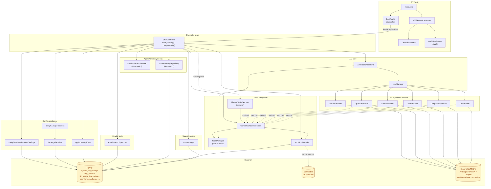

# Chat Path — Architecture

The chat path is the request flow that handles `POST /api/v1/chat`. This document describes:

1. **Component dependency graph** — who depends on whom (static structure).
2. **Request lifecycle** — what happens at runtime (sequence).
3. **Edge notes** — one line per edge, explaining why it exists.

Both diagrams use Mermaid; they render natively in GitHub and in the in-app Documentation panel (with a Mermaid renderer plugin) or any Mermaid-aware viewer.

---

## 1. Component dependency graph



---

## 2. Request lifecycle (streaming chat)

```mermaid
sequenceDiagram
    autonumber
    participant FE as Frontend
    participant IDX as index.php
    participant MW as MiddlewareProcessor
    participant CC as ChatController
    participant AD as AttachmentDispatcher
    participant ML as MCPToolsLoader
    participant CTE as CombinedToolsExecutor
    participant APA as AIPortfolioAssistant
    participant LLM as LLMManager
    participant P as Active Provider
    participant API as External LLM API
    participant UL as UsageLogger
    participant DB as MySQL

    FE->>IDX: POST /api/v1/chat (JWT, message, history, tools[])
    IDX->>MW: process(request)
    MW->>MW: CORS + AuthMiddleware (sets user_id)
    MW-->>IDX: request enriched
    IDX->>CC: chat(request)

    opt attachment_ids present
        CC->>AD: buildPrefix(ids, userId, provider)
        AD->>DB: load files
        AD-->>CC: prefix + image/pdf attachments
    end

    CC->>DB: applyDatabaseProviderSettings + applyPackageDefaults + applyUserApiKeys
    CC->>APA: new AIPortfolioAssistant(config)
    APA->>LLM: instantiate providers
    CC->>ML: loadToolsForUser(userId)
    ML->>DB: read mcp_servers / mcp_server_tools
    ML-->>CC: tool definitions
    CC->>CTE: new CombinedToolsExecutor(ToolsManager, ML)
    CC->>P: setFunctionExecutor(CTE) — on every provider

    Note over CC,FE: SSE headers set; sendEvent() flushes per chunk
    CC->>APA: streamChat(message, sessionId, userId, history, options)
    APA->>LLM: route to provider
    LLM->>P: streamChat(...)
    P->>API: POST /v1/messages (or equiv) — streamed

    loop stream chunks
        API-->>P: token chunk
        P-->>FE: SSE "response_chunk"
        opt model emits tool_call
            P->>CTE: execute(toolName, args)
            CTE->>ML: dispatch if MCP tool
            CTE->>P: result
            P->>API: continue with tool_result
        end
    end

    API-->>P: stream end
    P-->>CC: final {text, usage}
    CC->>UL: logUsage(provider, tokens, cost, …)
    UL->>DB: INSERT llm_usage_transactions
    CC-->>FE: SSE "complete"
```

---

## 3. Edge notes (why each dependency exists)

### Entry layer

| From → To | Why |
|---|---|
| `index.php` → `MiddlewareProcessor` | Builds the request from PHP globals and runs CORS + auth before dispatch. |
| `MiddlewareProcessor` → `CorsMiddleware` | Handles preflight `OPTIONS` and adds CORS headers. |
| `MiddlewareProcessor` → `AuthMiddleware` | Validates the JWT and stamps `request['user_id']`. Public routes bypass. |
| `index.php` → `FastRoute` | Maps the URI/method tuple to `[Controller, method]`. |

### Controller layer

| From → To | Why |
|---|---|
| `ChatController` → `applyDatabaseProviderSettings` | Lets the `system_llm_settings` admin table override `ai_config.php` (model, max_tokens, base_url, system prompt). |
| `ChatController` → `applyPackageDefaults` → `PackageResolver` | Applies the user's role-based capability bundle (allowed providers, MCP allowlist, quotas). |
| `ChatController` → `applyUserApiKeys` | Last-stage override: a user's own encrypted key wins over admin/default. |
| `ChatController` → `AttachmentDispatcher` | Loads files uploaded earlier via `/chat/upload`, extracts text (PDF, Office, plain text), or routes images/PDFs to providers that ingest them natively (Claude, Gemini). |
| `ChatController` → `UserMemoryRepository::buildMemoryBlock` | Hermes Layer 1 — frozen per-user memory injected into every prompt. |
| `ChatController` → `SessionSearchService::registerAsTool` | Hermes Layer 3 — registers a `session_search` tool scoped to the calling user's history. |

### Tools assembly

| From → To | Why |
|---|---|
| `ChatController` → `MCPToolsLoader` | Discovers and caches the MCP tool list for `userId` (globals + per-user MCP servers). |
| `MCPToolsLoader` → MCP servers (dotted edge) | Live `tools/list` calls when the cache (`mcp_server_tools`) is empty/stale. |
| `ChatController` → `CombinedToolsExecutor` | Single executor that fans tool calls between built-in (`ToolsManager`) and MCP. |
| `ChatController` → `FilteredToolsExecutor` (dotted) | Wraps the combined executor when the request includes a `tools[]` allowlist. Last-write-wins. |
| `Provider` ↔ `CombinedToolsExecutor` (dotted) | At runtime, providers call back into the executor whenever the model emits a `tool_call`. |

### LLM core

| From → To | Why |
|---|---|
| `ChatController` → `AIPortfolioAssistant` | Single facade that owns `ToolsManager`, `LLMManager`, and provider instantiation. |
| `AIPortfolioAssistant` → `LLMManager` | Provider router. `streamChat` selects one of six providers based on `options.provider`. |
| `LLMManager` → 6 Providers | Each provider owns the wire format for its API (Anthropic native, OpenAI-compatible, Gemini schema). |
| Provider → External LLM API | HTTP/SSE call to Anthropic, OpenAI, Google, xAI, DeepSeek, or Moonshot. |

### Logging

| From → To | Why |
|---|---|
| `ChatController` → `UsageLogger` → DB | Persists tokens, cost, response time per request to `llm_usage_transactions`. |

---

## Notes & caveats

- **Static reading only.** This diagram captures structural dependencies derived from `use` statements and `new`/method calls. Runtime branches (streaming vs. non-streaming, presence/absence of `tools[]`, attachment routing per provider) are summarized as edge labels but not exhaustive.
- **`verify()` and `compareOnly()`** share most of the same plumbing (config resolution, `AIPortfolioAssistant`, `UsageLogger`) but skip the tools assembly and use a single SSE client (`createVerificationSSEClient` / `createComparisonSSEClient`). They are not separately diagrammed here.
- **Non-streaming path** (`handleRegularChat`) is structurally identical to the streaming path minus the SSE plumbing — same dependencies, different exit shape.
- When the diagram drifts from reality, fix the **diagram** (it's source for humans); the dependency graph in code remains the source of truth for the machine.
